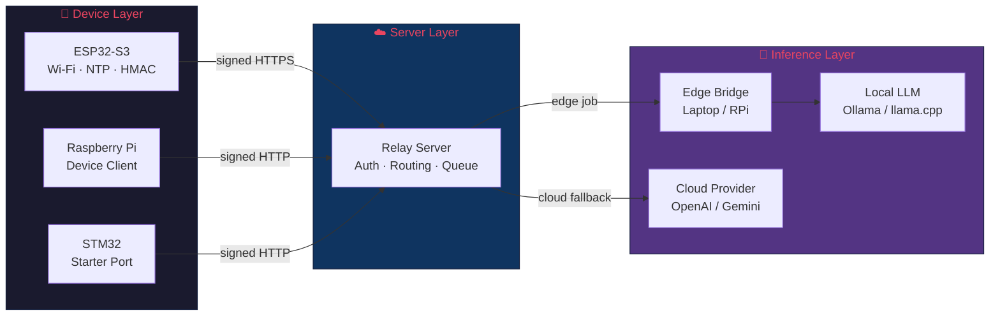

<div align="center">


# NanoMind

**Ultra-lightweight, secure AI assistant — edge first, cloud fallback ⚡**

Tiny footprint on ESP32-S3 · Local inference via Ollama · Cloud fallback when needed · Full web dashboard

---

[Getting Started](#-quick-start) · [Install](#-prerequisites--installation) · [Features](#-features) · [Architecture](#%EF%B8%8F-architecture) · [Dashboard](#%EF%B8%8F-dashboard-preview) · [Docs Hub](#-documentation)

[Cloud Deploy](#%EF%B8%8F-deployment-guide-cloud-only-mode) · [Edge Deploy](#-deployment-guide-edge-only-mode) · [Hybrid Deploy](#-deployment-guide-hybrid-mode-recommended)

[Setup Guide](docs/SETUP_GUIDE.md) · [Architecture Deep Dive](docs/ARCHITECTURE.md) · [Deployment Procedure](docs/PROCEDURE.md) · [Board Guides](docs/boards/)

</div>

---

## ✨ Features

- 🏎️ **Lean Device Firmware** — The ESP32-S3 stays thin: Wi-Fi, NTP clock sync, HMAC-SHA256 signing, and serial I/O. No on-device model weights.
- 🧠 **Edge-First Inference** — Local LLM inference through a laptop or Raspberry Pi bridge running Ollama, llama.cpp, or any compatible model server.
- ☁️ **Cloud Fallback** — Automatic failover to cloud providers (OpenAI, Gemini, etc.) when the edge bridge is offline.
- 🔐 **Secure by Design** — Shared-secret HMAC authentication, timestamp freshness windows, optional CA-pinned TLS, and reverse-proxy ready.
- 🌐 **Multi-Board Support** — First-class support for ESP32-S3 and Raspberry Pi, with porting kits for STM32 and generic boards.
- 🖥️ **Web Dashboard** — Full-featured Next.js gateway dashboard with real-time session management, agent control, model configuration, and cron jobs.
- ⚙️ **One-Command Setup** — Single `setup_stack.py` script generates all configs for relay, bridge, and device boards.
- 🔄 **Three Deployment Modes** — `cloud`, `edge`, or `hybrid` — choose your inference topology per deployment.

---

## 🖥️ Dashboard Preview

NanoMind ships with a full web-based gateway dashboard built with Next.js. Here's what it looks like:

<details>
<summary><b>📊 Overview — Gateway status, runtime, session, and coverage at a glance</b></summary>
<br>

</details>

<details>
<summary><b>💬 Chat — Direct runtime control for the active worker session</b></summary>
<br>

</details>

<details>
<summary><b>🔗 Channels — Google and Meta connection state from the edge server</b></summary>
<br>

</details>

<details>
<summary><b>📡 Instances — Connected clients and device presence</b></summary>
<br>

</details>

<details>
<summary><b>🗂️ Sessions — Active browser operator session inspection</b></summary>
<br>

</details>

<details>
<summary><b>📈 Usage — Message activity and session summary</b></summary>
<br>

</details>

<details>
<summary><b>⏰ Cron Jobs — Recurring worker definitions and workflow imports</b></summary>
<br>

</details>

<details>
<summary><b>🤖 Agents — Operator profile and runtime management</b></summary>
<br>

</details>

<details>
<summary><b>⚙️ Config — System settings, devices, models, security, and automation</b></summary>
<br>

<br><br>

</details>

<details>
<summary><b>📖 Docs — Built-in repository guides and local project references</b></summary>
<br>

</details>

---

## 🏗️ Architecture

NanoMind keeps the ESP32-S3 as a durable networked endpoint — inference always runs elsewhere.



### Core Design Principles

- **Thin device** — No on-device model weights, no WebSocket stack, no large JSON dependencies.
- **Inference elsewhere** — `edge` (laptop bridge → local LLM) or `cloud` (remote provider).
- **Signed requests** — HMAC-SHA256 with timestamp freshness on every device ↔ relay call.
- **Bounded resource use** — Polling intervals and request sizes are capped, failure modes are simple.

> For the full architecture deep dive, see [docs/ARCHITECTURE.md](docs/ARCHITECTURE.md).

---

## 📂 Repository Layout

```
NanoMind/
├── firmware/              # Primary ESP32-S3 firmware (Arduino/PlatformIO)
├── relay/                 # Secure relay/API server (Python)
├── bridge/                # Edge bridge for local model inference (Python)
├── client/                # Admin CLI for remote prompts
├── small_claw/            # Core library — relay, bridge, and common modules
├── ai-assistant-firmware-  # Next.js web gateway dashboard
│   &-edge-server/
├── board_support/         # Raspberry Pi, STM32, and generic-board starters
│   ├── raspberry_pi/
│   ├── stm32/
│   └── generic/
├── tools/                 # Setup generator for relay, bridge, and board configs
├── docs/                  # Architecture, deployment, and per-board guides
│   ├── ARCHITECTURE.md
│   ├── SETUP_GUIDE.md
│   ├── PROCEDURE.md
│   └── boards/
│       ├── ESP32S3_SETUP.md
│       ├── RASPBERRY_PI_SETUP.md
│       ├── STM32_SETUP.md
│       └── OTHER_BOARDS_SETUP.md
└── UI_Look/               # Dashboard screenshots and project logo
    └── Logo/
```

---

## 📥 Prerequisites & Installation

Install the required tools for your operating system. NanoMind components use **Python** (relay, bridge, tools), **PlatformIO** (ESP32-S3 firmware), and **Node.js** (web dashboard).

### Required Software

| Tool | Used By | Minimum Version |
| --- | --- | --- |
| Python | Relay, bridge, admin CLI, setup tools | 3.10+ |
| PlatformIO (CLI or IDE) | ESP32-S3 firmware build & flash | Latest |
| Node.js + npm | Web gateway dashboard | 18+ |
| Git | Cloning the repository | Any |
| Ollama / llama.cpp | Local model server (edge/hybrid modes) | Latest |
| Cloud API key | Cloud provider access (cloud/hybrid modes) | — |

### 🪟 Windows

<details>
<summary><b>Click to expand Windows setup</b></summary>

#### Option A: Using winget (recommended)

```powershell
# Install Python 3
winget install Python.Python.3.12

# Install Node.js (LTS)
winget install OpenJS.NodeJS.LTS

# Install Git
winget install Git.Git
```

#### Option B: Using Chocolatey

```powershell
choco install python3 nodejs-lts git -y
```

#### Install PlatformIO

```powershell
# Via pip (after Python is installed)
pip install platformio

# Or install the VS Code extension: search "PlatformIO IDE"
```

#### Install Ollama (for edge/hybrid modes)

Download from [ollama.com](https://ollama.com/download/windows) and run the installer.

```powershell
# After installing, pull a model
ollama pull qwen2.5:3b-instruct
```

> **Note:** On Windows, use `python` instead of `python3` in all commands below.

</details>

### 🍎 macOS

<details>
<summary><b>Click to expand macOS setup</b></summary>

#### Using Homebrew (recommended)

```bash
# Install Homebrew if not present
/bin/bash -c "$(curl -fsSL https://raw.githubusercontent.com/Homebrew/install/HEAD/install.sh)"

# Install prerequisites
brew install python@3.12 node git

# Install PlatformIO
pip3 install platformio

# Install Ollama (for edge/hybrid modes)
brew install ollama
ollama pull qwen2.5:3b-instruct
```

#### Using MacPorts

```bash
sudo port install python312 nodejs18 git
pip3 install platformio
```

</details>

### 🐧 Linux

<details>
<summary><b>Ubuntu / Debian</b></summary>

```bash
# Update package lists
sudo apt update && sudo apt upgrade -y

# Install Python 3 and pip
sudo apt install -y python3 python3-pip python3-venv

# Install Node.js (via NodeSource)
curl -fsSL https://deb.nodesource.com/setup_lts.x | sudo -E bash -
sudo apt install -y nodejs

# Install Git
sudo apt install -y git

# Install PlatformIO
pip3 install platformio

# Install Ollama (for edge/hybrid modes)
curl -fsSL https://ollama.com/install.sh | sh
ollama pull qwen2.5:3b-instruct
```

</details>

<details>
<summary><b>Fedora / RHEL / CentOS</b></summary>

```bash
# Install Python 3 and pip
sudo dnf install -y python3 python3-pip

# Install Node.js
sudo dnf install -y nodejs npm

# Install Git
sudo dnf install -y git

# Install development tools (may be needed for PlatformIO)
sudo dnf group install -y "Development Tools"

# Install PlatformIO
pip3 install platformio

# Install Ollama (for edge/hybrid modes)
curl -fsSL https://ollama.com/install.sh | sh
ollama pull qwen2.5:3b-instruct
```

</details>

<details>
<summary><b>Arch Linux / Manjaro</b></summary>

```bash
# Install base packages
sudo pacman -Syu --noconfirm python python-pip nodejs npm git base-devel

# Install PlatformIO
pip install platformio

# Install Ollama (for edge/hybrid modes)
# Option A: AUR
yay -S ollama

# Option B: Official installer
curl -fsSL https://ollama.com/install.sh | sh

ollama pull qwen2.5:3b-instruct
```

</details>

<details>
<summary><b>openSUSE</b></summary>

```bash
sudo zypper install -y python3 python3-pip nodejs npm git
pip3 install platformio

# Install Ollama (for edge/hybrid modes)
curl -fsSL https://ollama.com/install.sh | sh
ollama pull qwen2.5:3b-instruct
```

</details>

### 🍓 Raspberry Pi (Raspberry Pi OS)

<details>
<summary><b>Click to expand Raspberry Pi setup</b></summary>

```bash
sudo apt update && sudo apt upgrade -y
sudo apt install -y python3 python3-pip python3-venv nodejs npm git

# Install PlatformIO (only if building firmware on the Pi)
pip3 install platformio

# Install Ollama (for edge inference on Pi 4/5)
curl -fsSL https://ollama.com/install.sh | sh
ollama pull qwen2.5:3b-instruct
```

> **Tip:** If memory is limited on older Pi models, run the bridge on the Pi and point it at a separate LAN machine hosting the model server.

</details>

### Verify Installation

After installing, confirm everything is working:

```bash
python3 --version      # Should be 3.10+
node --version         # Should be 18+
npm --version
git --version
pio --version          # PlatformIO CLI
ollama --version       # Only for edge/hybrid
```

---

## ☁️ Deployment Guide: Cloud-Only Mode

Cloud mode uses a remote LLM provider (OpenAI, Gemini, etc.) with no local inference. This is the **simplest deployment** — no bridge or local model server needed.

> 📖 Full details: [docs/SETUP_GUIDE.md](docs/SETUP_GUIDE.md) — Step 2 (Cloud-only) · [docs/PROCEDURE.md](docs/PROCEDURE.md) — Sections 2–6

**What you need:**
- A cloud API key (OpenAI, Gemini, or compatible provider)
- The relay server (Python)
- One or more device boards

### Step 1: Clone the repository

```bash
git clone https://github.com/YOUR_USERNAME/NanoMind.git
cd NanoMind
```

### Step 2: Generate cloud-only configs

```bash
python3 tools/setup_stack.py \
  --mode cloud \
  --board esp32s3 \
  --relay-url https://relay.example.com
```

### Step 3: Start the relay

```bash
python3 relay/run_relay.py setup_output/relay/config.json
```

Verify it's running:

```bash
curl http://127.0.0.1:8787/healthz
# Expected: {"ok": true}
```

### Step 4: Provision your device

**ESP32-S3:**

```bash
cp setup_output/firmware/esp32s3/secrets.h firmware/include/secrets.h
pio run -d firmware
pio run -d firmware -t upload
pio device monitor -d firmware
```

**Raspberry Pi:**

```bash
cp setup_output/board_support/raspberry_pi/device_config.json board_support/raspberry_pi/device_config.json
python3 board_support/raspberry_pi/pi_device_client.py \
  --config board_support/raspberry_pi/device_config.json --console
```

**STM32:** See [docs/boards/STM32_SETUP.md](docs/boards/STM32_SETUP.md)

### Step 5: Test

```bash
python3 client/send_prompt.py \
  --relay-url http://127.0.0.1:8787 \
  --token YOUR_ADMIN_TOKEN \
  --mode cloud \
  --prompt "Hello from cloud mode!"
```

> ⚠️ Make sure `cloud_provider`, API key, and base URL are set in `setup_output/relay/config.json`. See [docs/PROCEDURE.md](docs/PROCEDURE.md) — Section 9 for troubleshooting.

---

## 🧠 Deployment Guide: Edge-Only Mode

Edge mode runs **all inference locally** through a bridge connected to a local model server (Ollama, llama.cpp, etc.). No cloud API dependency — full privacy and offline capability.

> 📖 Full details: [docs/SETUP_GUIDE.md](docs/SETUP_GUIDE.md) — Step 4 (Option A/B) · [docs/PROCEDURE.md](docs/PROCEDURE.md) — Sections 4–6

**What you need:**
- A local model server (e.g., Ollama on a laptop or Raspberry Pi)
- The relay server (Python)
- The bridge (Python)
- One or more device boards

### Step 1: Clone the repository

```bash
git clone https://github.com/YOUR_USERNAME/NanoMind.git
cd NanoMind
```

### Step 2: Install and start a local model server

```bash
# Using Ollama (recommended)
ollama pull qwen2.5:3b-instruct
ollama serve
# Verify: curl http://127.0.0.1:11434/api/tags
```

### Step 3: Generate edge-only configs

**ESP32-S3 device:**

```bash
python3 tools/setup_stack.py \
  --mode edge \
  --board esp32s3 \
  --relay-url http://192.168.1.10:8787 \
  --wifi-ssid your-wifi-name \
  --wifi-password your-wifi-password
```

**Raspberry Pi device:**

```bash
python3 tools/setup_stack.py \
  --mode edge \
  --board raspberry-pi \
  --relay-url http://192.168.1.10:8787
```

### Step 4: Start the relay

```bash
python3 relay/run_relay.py setup_output/relay/config.json
```

### Step 5: Start the edge bridge

```bash
python3 bridge/run_bridge.py setup_output/bridge/config.json
```

Confirm the relay reports a live bridge.

### Step 6: Provision your device

Follow the same device flashing steps as cloud mode above, using the edge-generated `secrets.h`.

### Step 7: Test

```bash
python3 client/send_prompt.py \
  --relay-url http://127.0.0.1:8787 \
  --token YOUR_ADMIN_TOKEN \
  --mode edge \
  --prompt "Hello from edge mode!"
```

> 💡 The bridge long-polls the relay for edge jobs, runs them against your local model server, and returns results. See [docs/ARCHITECTURE.md](docs/ARCHITECTURE.md) — Request Flows.

---

## 🔄 Deployment Guide: Hybrid Mode (Recommended)

Hybrid mode gives you the **best of both worlds**: low-latency local inference when the edge bridge is online, with automatic cloud fallback when it's not. This is the **recommended deployment mode**.

> 📖 Full details: [docs/SETUP_GUIDE.md](docs/SETUP_GUIDE.md) — Steps 2–7 · [docs/PROCEDURE.md](docs/PROCEDURE.md) — Full sequence

**What you need:**
- A local model server (Ollama, llama.cpp, etc.)
- A cloud API key (OpenAI, Gemini, or compatible)
- The relay server (Python)
- The bridge (Python)
- One or more device boards

### Step 1: Clone the repository

```bash
git clone https://github.com/YOUR_USERNAME/NanoMind.git
cd NanoMind
```

### Step 2: Install the local model server

```bash
ollama pull qwen2.5:3b-instruct
ollama serve
```

### Step 3: Generate hybrid configs

```bash
python3 tools/setup_stack.py \
  --mode hybrid \
  --board esp32s3 \
  --relay-url http://127.0.0.1:8787 \
  --wifi-ssid your-wifi-name \
  --wifi-password your-wifi-password
```

### Step 4: Start the relay

```bash
python3 relay/run_relay.py setup_output/relay/config.json
```

### Step 5: Start the edge bridge

```bash
python3 bridge/run_bridge.py setup_output/bridge/config.json
```

### Step 6: Provision your device

```bash
cp setup_output/firmware/esp32s3/secrets.h firmware/include/secrets.h
pio run -d firmware
pio run -d firmware -t upload
pio device monitor -d firmware
```

### Step 7: Launch the web dashboard (optional)

```bash
cd ai-assistant-firmware-\&-edge-server
npm install
npm run dev
```

### Step 8: Validate the full system

Follow the [verification sequence from docs/PROCEDURE.md](docs/PROCEDURE.md):

1. Relay `healthz` returns `ok: true`
2. Admin prompt returns a reply
3. Device heartbeat returns `ok: true`
4. Device prompt returns a reply
5. Stop the bridge → verify cloud fallback works
6. Restart the bridge → verify edge resumes

```bash
# Quick health check
curl http://127.0.0.1:8787/healthz

# Admin prompt test
python3 client/send_prompt.py \
  --relay-url http://127.0.0.1:8787 \
  --token YOUR_ADMIN_TOKEN \
  --mode hybrid \
  --prompt "Ping from admin client."
```

> 🔐 **Production hardening:** Before unattended deployment, apply the checklist from [docs/PROCEDURE.md](docs/PROCEDURE.md) — Section 7: unique secrets per board, HTTPS + CA pinning, systemd service units, firewall rules, and log rotation.

---

## 🔧 Production Hardening Checklist

Before deploying NanoMind in production, review these items from [docs/PROCEDURE.md](docs/PROCEDURE.md):

- [ ] Unique secrets per board and per bridge
- [ ] HTTPS and CA pinning for ESP32-S3 and STM32
- [ ] systemd service units or another process supervisor for relay and bridge
- [ ] Firewall rules on the relay host
- [ ] Log rotation for relay and bridge output
- [ ] Regular backup of relay state if required
- [ ] Replace all generated secrets with deployment-specific ones

> 📖 See also: [docs/SETUP_GUIDE.md](docs/SETUP_GUIDE.md) — Step 7 (Local to Production) and [docs/PROCEDURE.md](docs/PROCEDURE.md) — Section 7 (Production Hardening).

---

## 🚀 Quick Start

### 1. Generate setup files

Hybrid ESP32-S3 example:

```bash
python3 tools/setup_stack.py \
  --mode hybrid \
  --board esp32s3 \
  --relay-url http://127.0.0.1:8787 \
  --wifi-ssid your-wifi-name \
  --wifi-password your-wifi-password
```

This generates:

- `setup_output/relay/config.json`
- `setup_output/bridge/config.json`
- `setup_output/firmware/esp32s3/secrets.h`
- `setup_output/setup_summary.txt`

### 2. Start the relay

```bash
python3 relay/run_relay.py setup_output/relay/config.json
```

### 3. Start the edge bridge for local inference

Install and start your local model server first, for example Ollama on a laptop or Raspberry Pi:

```bash
python3 bridge/run_bridge.py setup_output/bridge/config.json
```

### 4. Build and flash the ESP32-S3 firmware

```bash
cp setup_output/firmware/esp32s3/secrets.h firmware/include/secrets.h
pio run -d firmware
pio run -d firmware -t upload
pio device monitor -d firmware
```

### 5. Send a remote admin prompt

```bash
python3 client/send_prompt.py \
  --relay-url http://127.0.0.1:8787 \
  --token YOUR_ADMIN_TOKEN \
  --device-id claw-01 \
  --mode hybrid \
  --prompt "Summarize the current device status."
```

### 6. Launch the web dashboard

```bash
cd ai-assistant-firmware-\&-edge-server
npm install
npm run dev
```

Open `http://localhost:3000` in your browser.

---

## ⚙️ Deployment Modes

| Mode | Behavior | Best For |
| --- | --- | --- |
| `cloud` | Cloud-only inference | Simplest first deployment |
| `edge` | Local-only inference through the bridge | Full privacy, no cloud dependency |
| `hybrid` | Edge first, cloud fallback | Low-latency local + reliable fallback |

The relay also accepts the canonical API names `cloud_only`, `edge_only`, and `edge_then_cloud`. `auto` is treated the same as `hybrid`.

---

## 🔧 Supported Hardware

| Target | Role | Status |
| --- | --- | --- |
| ESP32-S3 | Main device firmware | ✅ First-class support |
| Raspberry Pi | Relay, bridge, or signed device client | ✅ First-class support |
| STM32 | Starter port using the same signed HTTP contract | 📦 Porting kit included |
| Other boards | Any board with HTTP, clock sync, and HMAC-SHA256 | 📋 Contract guide included |

---

## 📚 Documentation

### Core Docs

| Document | Description | Path |
| --- | --- | --- |
| Architecture | System layout and component relationships | [ARCHITECTURE.md](docs/ARCHITECTURE.md) |
| Setup Guide | Full deployment walkthrough (cloud, edge, hybrid) | [SETUP_GUIDE.md](docs/SETUP_GUIDE.md) |
| Deployment Procedure | Operational sequence for controlled bring-up | [PROCEDURE.md](docs/PROCEDURE.md) |

### Board-Specific Guides

| Board | Guide |
| --- | --- |
| ESP32-S3 | [ESP32S3_SETUP.md](docs/boards/ESP32S3_SETUP.md) |
| Raspberry Pi | [RASPBERRY_PI_SETUP.md](docs/boards/RASPBERRY_PI_SETUP.md) |
| STM32 | [STM32_SETUP.md](docs/boards/STM32_SETUP.md) |
| Other Boards | [OTHER_BOARDS_SETUP.md](docs/boards/OTHER_BOARDS_SETUP.md) |

### Board Support Starters

| Board | Starter Files |
| --- | --- |
| Raspberry Pi | [board_support/raspberry_pi/](board_support/raspberry_pi/) |
| STM32 | [board_support/stm32/](board_support/stm32/) |
| Generic | [board_support/generic/](board_support/generic/) |

### Web Dashboard

The Next.js gateway dashboard lives in [`ai-assistant-firmware-&-edge-server/`](ai-assistant-firmware-&-edge-server/). See its [README](ai-assistant-firmware-&-edge-server/README.md) for setup instructions.

---

## 🏛️ Architecture Choice

NanoMind keeps:

- **Arduino/PlatformIO** for the main ESP32-S3 target.
- **Python** relay and bridge for easier bring-up on laptops and Raspberry Pi.
- **Next.js** web dashboard for full gateway control and monitoring.
- The same core design principle: the microcontroller stays small, inference runs elsewhere.

---

## 🔌 Serial Commands

When connected to the ESP32-S3 via serial monitor:

| Command | Action |
| --- | --- |
| `/help` | Show available commands |
| `/status` | Display current device status |
| `/heartbeat` | Send heartbeat to relay |
| `/mode auto` | Switch to auto (hybrid) mode |
| `/mode hybrid` | Switch to hybrid mode |
| `/mode edge` | Switch to edge-only mode |
| `/mode cloud` | Switch to cloud-only mode |
| *any other text* | Sent as a prompt to the relay |

---

## 🛡️ Security

- Shared-secret HMAC between relay and each device or bridge.
- Timestamp freshness window to reduce replay risk.
- Optional built-in TLS on the relay, with reverse-proxy deployment recommended.
- CA-pinned TLS support on the ESP32 firmware.

> For production TLS, paste the relay CA certificate into `RELAY_CA_CERT` in `secrets.h`.

---

## 🐛 Troubleshooting

| Error | Cause |
| --- | --- |
| `signature mismatch` | Secret or body doesn't match between device and relay |
| `timestamp outside allowed window` | Board clock is wrong or NTP is missing |
| `no live edge bridge` | Bridge is down or bridge secret is incorrect |
| `cloud provider is not configured` | Cloud mode selected without cloud settings |

---

<div align="center">
<sub>Built with ❤️ for embedded AI</sub>
</div>
