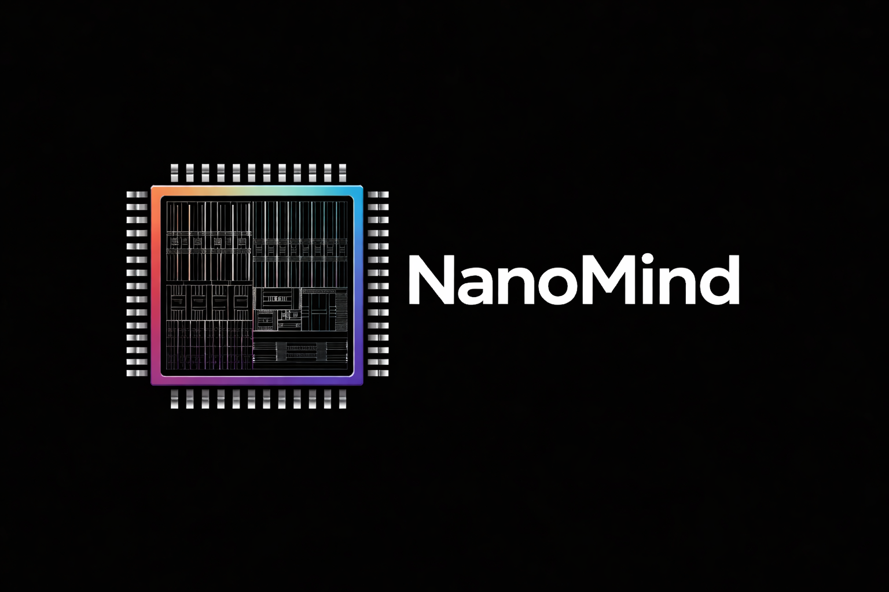
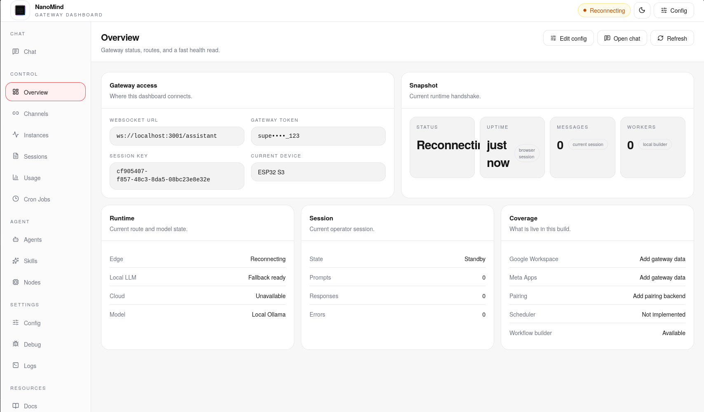
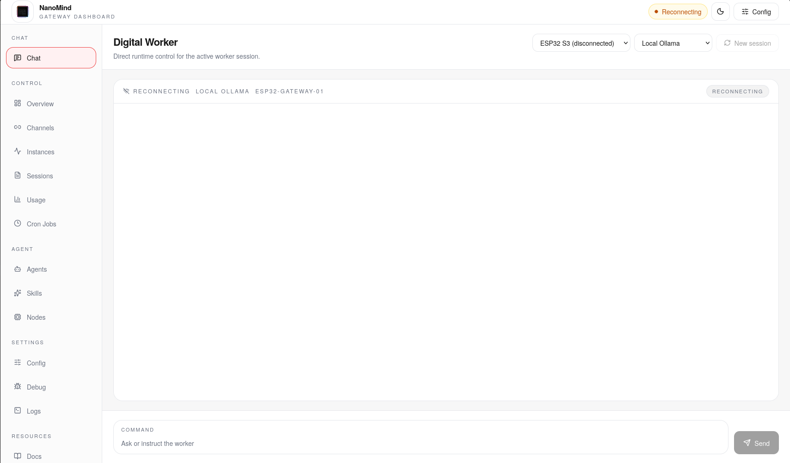
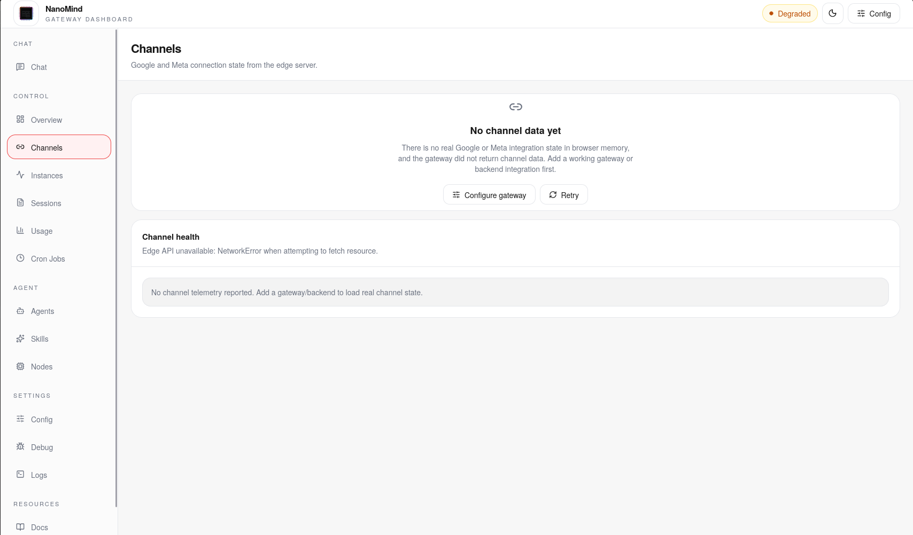
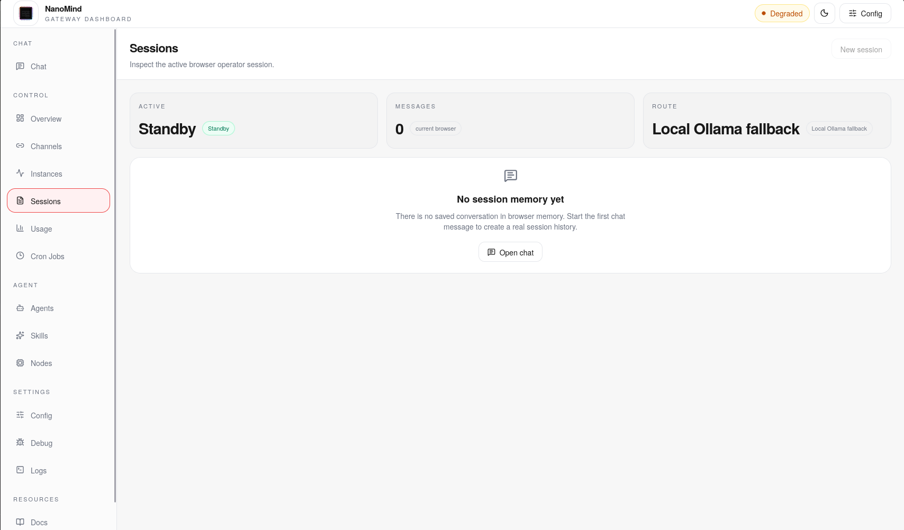
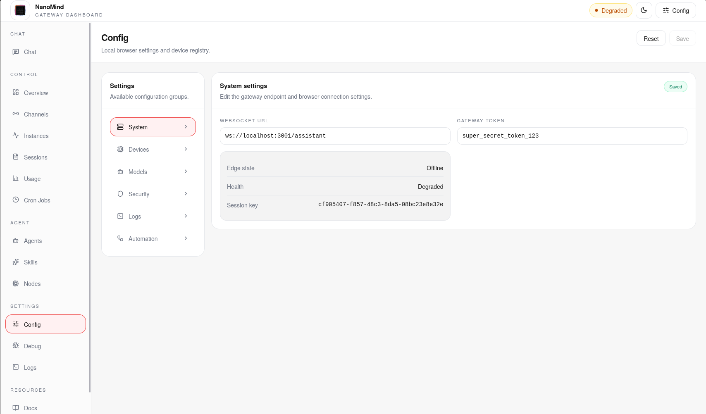
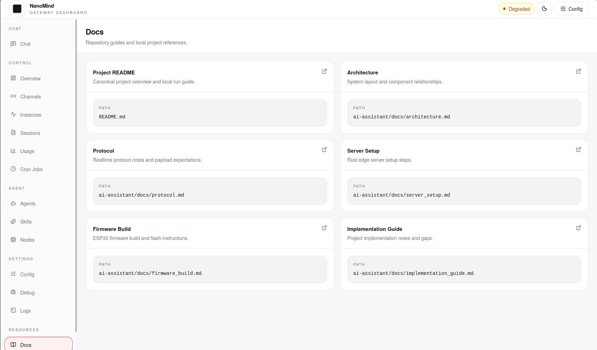

<div align="center">



# NanoMind

Local-first AI assistant stack with a Next.js control UI, a Rust edge server, and ESP32-S3 firmware.

[Quick Start](docs/get-started/quick-start.md) · [Install](docs/install/overview.md) · [Docs](docs/README.md) · [Repository Map](docs/reference/repository-map.md) · [Architecture](ai-assistant/docs/architecture.md)

</div>

## Overview

NanoMind combines three working layers in one repository:

- a browser control console built with Next.js in `app/`, `components/`, `hooks/`, and `api/`
- a Rust edge server in `ai-assistant/edge_server/` for WebSocket and HTTP routing, local Ollama access, and cloud fallback
- ESP32-S3 firmware in `ai-assistant/firmware/` for device-side connectivity

What is already here:

- a multi-panel operator UI with overview, chat, channels, instances, sessions, usage, cron jobs, agents, config, logs, and docs views
- browser-side workflow editing and import/export
- local model routing with Ollama plus Gemini/browser fallback
- a documentation tree under `docs/` that maps to the current repository structure

Current gaps called out by the repo docs:

- browser and edge-server streaming are not fully aligned yet
- Google and Meta integrations are placeholder implementations
- pairing and workflow scheduling backends are not implemented yet

## Quick Start

### 1. Frontend only

Install dependencies:

```bash
npm install
```

Create `.env.local` at the repository root:

```env
NEXT_PUBLIC_WS_URL=ws://localhost:3001/assistant
NEXT_PUBLIC_AUTH_TOKEN=super_secret_token_123
NEXT_PUBLIC_GEMINI_API_KEY=
NEXT_PUBLIC_OLLAMA_URL=http://localhost:11434
```

Run the UI:

```bash
npm run dev
```

Open `http://127.0.0.1:3000`.

### 2. Frontend plus Rust edge server

Create `ai-assistant/edge_server/.env`:

```env
PORT=3001
OLLAMA_URL=http://localhost:11434
AUTH_TOKEN=super_secret_token_123
CLOUD_API_KEY=
```

Start the edge server:

```bash
cd ai-assistant/edge_server
cargo run --release
```

With Ollama running locally, the browser UI can talk to the edge server on `ws://localhost:3001/assistant`.

### 3. Full stack with ESP32-S3

Edit [ai-assistant/firmware/main/config.h](ai-assistant/firmware/main/config.h), then build and flash:

```bash
cd ai-assistant/firmware
idf.py set-target esp32s3
idf.py build
idf.py -p /dev/ttyUSB0 flash monitor
```

For the shortest path by runtime layer, use:

- [Quick Start](docs/get-started/quick-start.md)
- [Frontend Install](docs/install/frontend.md)
- [Edge Server Install](docs/install/edge-server.md)
- [Firmware Install](docs/install/firmware.md)

## Dashboard Preview

Click any preview to open the full-size asset. The README uses sanitized files from `docs/screenshots/` so GitHub renders and opens them reliably, and legacy `UI_Look/` image paths are kept in the repo for compatibility with older shared GitHub links.

| Overview | Chat |
| --- | --- |
| <a href="docs/screenshots/dashboard-overview.png"></a> | <a href="docs/screenshots/dashboard-chat.png"></a> |

| Channels | Sessions |
| --- | --- |
| <a href="docs/screenshots/dashboard-channels.png"></a> | <a href="docs/screenshots/dashboard-sessions.png"></a> |

| Config | Docs |
| --- | --- |
| <a href="docs/screenshots/dashboard-config.png"></a> | <a href="docs/screenshots/dashboard-docs.png"></a> |

## Repository Layout

```text
NanoMind/
├── app/                      # Next.js app entrypoints
├── components/               # Control console, chat UI, settings, and workspace components
├── hooks/                    # Zustand-backed NanoMind client state
├── api/                      # Browser HTTP and WebSocket clients
├── lib/                      # Runtime configuration helpers
├── public/                   # PWA assets and static files
├── docs/                     # Repo-aligned documentation tree and README-safe screenshots
├── ui_look/                  # Source screenshots and logo captures
└── ai-assistant/
    ├── edge_server/          # Rust edge runtime
    ├── firmware/             # ESP32-S3 firmware
    └── docs/                 # Legacy architecture and protocol notes
```

More detail:

- [Repository Map](docs/reference/repository-map.md)
- [Frontend Files](docs/reference/frontend-files.md)
- [Edge Server Files](docs/reference/edge-server-files.md)
- [Firmware Files](docs/reference/firmware-files.md)

## Documentation

Start here:

- [Docs Hub](docs/README.md)
- [Get Started Overview](docs/get-started/overview.md)
- [Quick Start](docs/get-started/quick-start.md)

Installation and runtime pages:

- [Install Overview](docs/install/overview.md)
- [Frontend Control UI](docs/install/frontend.md)
- [Rust Edge Server](docs/install/edge-server.md)
- [ESP32 Firmware](docs/install/firmware.md)
- [Browser Control UI](docs/platforms/browser-control-ui.md)
- [ESP32-S3 Device Client](docs/platforms/esp32-s3.md)

Operations and support:

- [Gateway Runbook](docs/gateway-ops/runbook.md)
- [Security](docs/gateway-ops/security.md)
- [Troubleshooting](docs/help/troubleshooting.md)
- [FAQ](docs/help/faq.md)

Historical project notes:

- [Architecture](ai-assistant/docs/architecture.md)
- [Protocol](ai-assistant/docs/protocol.md)
- [Server Setup](ai-assistant/docs/server_setup.md)
- [Firmware Build](ai-assistant/docs/firmware_build.md)

## Development Notes

- The frontend defaults to `http://127.0.0.1:3000`.
- The docs recommend running the edge server on `http://127.0.0.1:3001` to avoid conflicting with the Next.js dev server.
- Local inference is designed around Ollama, with browser-side Gemini support and server-side cloud fallback available when configured.

## License

[MIT](LICENSE)
