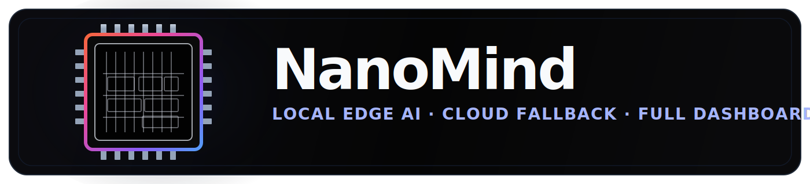
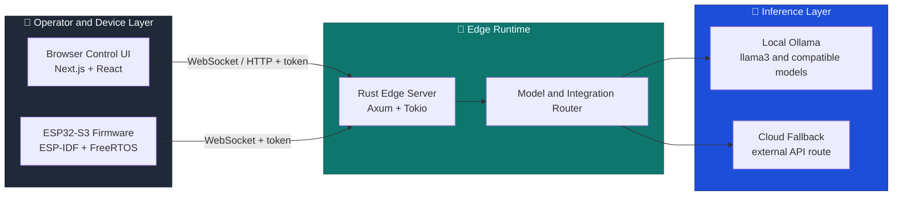

<div align="center">



# NanoMind

**Ultra-lightweight, secure AI assistant stack - local edge first, cloud fallback ready**

Tiny footprint on ESP32-S3 · Local inference via Ollama · Cloud fallback when needed · Full web dashboard

---

[Getting Started](#quick-start) · [Install](#prerequisites-installation) · [Features](#features) · [Architecture](#architecture) · [Dashboard](#dashboard-preview) · [Docs Hub](docs/README.md)

[Frontend Only](#deployment-frontend-only) · [Local Edge](#deployment-local-edge) · [Full Stack](#deployment-full-stack)

[Quick Start](docs/get-started/quick-start.md) · [Install Overview](docs/install/overview.md) · [Architecture Deep Dive](ai-assistant/docs/architecture.md) · [Runbook](docs/gateway-ops/runbook.md) · [Repository Map](docs/reference/repository-map.md)

</div>

---

<a id="features"></a>

## ✨ Features

- 🏎️ **Lean device firmware** - The ESP32-S3 side stays focused on connectivity, auth, and message transport instead of on-device model hosting.
- 🧠 **Edge-first inference** - The Rust edge server prefers local Ollama routing for fast private inference on your machine or LAN host.
- ☁️ **Cloud fallback ready** - Cloud routing exists as a fallback path when the local model route is unavailable and credentials are configured.
- 🔐 **Shared-token security model** - Browser and firmware requests are authenticated against the edge server over HTTP and WebSocket paths.
- 🖥️ **Full operator dashboard** - The Next.js UI includes Overview, Chat, Channels, Instances, Sessions, Usage, Cron Jobs, Agents, Config, Logs, and Docs surfaces.
- ⚙️ **Workflow builder included** - Automation flows can be created, imported, exported, and edited directly in the browser UI.
- 📚 **Repo-aligned documentation** - The `docs/` tree mirrors the current repository structure instead of pointing at stale external notes.
- 🔄 **Three practical runtime paths** - Run the UI alone, run UI plus local edge routing, or connect the full stack with ESP32 firmware.

---

<a id="dashboard-preview"></a>

## 🖥️ Dashboard Preview

NanoMind ships with a full web-based gateway dashboard built with Next.js. The previews below use the working `UI_Look/` image paths so they render directly on GitHub, and each image still opens full-size when clicked.

<table>
  <tr>
    <td width="50%" align="center">
      <b>📊 Overview</b><br/>
      Gateway status, runtime, session, and coverage at a glance.<br/><br/>
      <a href="UI_Look/Screenshot From 2026-03-13 13-48-47.png"></a>
    </td>
    <td width="50%" align="center">
      <b>💬 Chat</b><br/>
      Direct runtime control for the active worker session.<br/><br/>
      <a href="UI_Look/Screenshot From 2026-03-13 13-48-36.png"></a>
    </td>
  </tr>
  <tr>
    <td width="50%" align="center">
      <b>🔗 Channels</b><br/>
      Google and Meta connection state from the edge server.<br/><br/>
      <a href="UI_Look/Screenshot From 2026-03-13 13-48-59.png"></a>
    </td>
    <td width="50%" align="center">
      <b>📡 Instances</b><br/>
      Connected clients and device presence.<br/><br/>
      <a href="UI_Look/Screenshot From 2026-03-13 13-49-07.png"></a>
    </td>
  </tr>
  <tr>
    <td width="50%" align="center">
      <b>🗂️ Sessions</b><br/>
      Active browser operator session inspection.<br/><br/>
      <a href="UI_Look/Screenshot From 2026-03-13 13-49-15.png"></a>
    </td>
    <td width="50%" align="center">
      <b>📈 Usage</b><br/>
      Message activity and session summary.<br/><br/>
      <a href="UI_Look/Screenshot From 2026-03-13 13-49-22.png"></a>
    </td>
  </tr>
  <tr>
    <td width="50%" align="center">
      <b>⏰ Cron Jobs</b><br/>
      Recurring worker definitions and workflow imports.<br/><br/>
      <a href="UI_Look/Screenshot From 2026-03-13 13-49-33.png"></a>
    </td>
    <td width="50%" align="center">
      <b>🤖 Agents</b><br/>
      Operator profile and runtime management.<br/><br/>
      <a href="UI_Look/Screenshot From 2026-03-13 13-49-40.png"></a>
    </td>
  </tr>
  <tr>
    <td width="50%" align="center">
      <b>⚙️ Config</b><br/>
      System settings, devices, models, security, and automation.<br/><br/>
      <a href="UI_Look/Screenshot From 2026-03-13 13-49-51.png"></a><br/><br/>
      <a href="UI_Look/Screenshot From 2026-03-13 13-50-03.png"></a>
    </td>
    <td width="50%" align="center">
      <b>📖 Docs</b><br/>
      Built-in repository guides and local project references.<br/><br/>
      <a href="UI_Look/Screenshot From 2026-03-13 13-50-15.png"></a>
    </td>
  </tr>
</table>

---

<a id="architecture"></a>

## 🏗️ Architecture

NanoMind keeps the browser UI and device client lightweight while inference and routing happen through the local edge runtime.



### Core Design Principles

- **Thin clients** - The browser and ESP32 stay focused on control, state, and transport rather than model orchestration.
- **Inference elsewhere** - Local Ollama is the preferred runtime path, with cloud fallback available when configured.
- **Shared auth boundary** - A shared token protects both browser and device routes into the edge runtime.
- **Progressive stack bring-up** - You can start with the UI only, then add the edge server, then add firmware once the local route is healthy.
- **Documentation mirrors reality** - The docs tree follows the current repo layout and calls out current gaps instead of hiding them.

> For the historical architecture notes, see [ai-assistant/docs/architecture.md](ai-assistant/docs/architecture.md).

---

## 📂 Repository Layout

```text
NanoMind/
├── app/                         # Next.js app entrypoints
├── components/                  # Control console, chat, logs, config, automation UI
├── hooks/                       # Browser-side NanoMind state and runtime hooks
├── api/                         # Browser HTTP and WebSocket clients
├── lib/                         # Runtime config and helper utilities
├── public/                      # Static app assets and icons
├── docs/                        # Current documentation tree
│   ├── get-started/
│   ├── install/
│   ├── gateway-ops/
│   ├── help/
│   ├── reference/
│   └── screenshots/
├── UI_Look/                     # GitHub-safe legacy image paths for README compatibility
├── ui_look/                     # Source screenshots and original logo captures
└── ai-assistant/
    ├── edge_server/             # Rust edge runtime
    ├── firmware/                # ESP32-S3 firmware project
    ├── docs/                    # Historical architecture and protocol notes
    └── tools/                   # Local utility scripts
```

More detail:

- [Repository Map](docs/reference/repository-map.md)
- [Frontend Files](docs/reference/frontend-files.md)
- [Rust Edge Server Files](docs/reference/edge-server-files.md)
- [Firmware Files](docs/reference/firmware-files.md)
- [Environment Variables](docs/reference/environment-variables.md)

---

<a id="prerequisites-installation"></a>

## 📥 Prerequisites & Installation

Install the tools for the runtime layers you actually plan to use. NanoMind currently centers on **Node.js** for the dashboard, **Rust** for the edge server, **Ollama** for local inference, and **ESP-IDF** for the device firmware.

### Required Software

| Tool | Used By | Recommended |
| --- | --- | --- |
| Node.js + npm | Browser control UI | Node.js 24 |
| Rust toolchain | Local edge server | Stable via `rustup` |
| Ollama | Local inference path | Latest |
| Git | Repository clone and updates | Any recent version |
| ESP-IDF | ESP32-S3 firmware build and flash | 5.x |
| USB serial access | ESP32 flashing and monitor | Required for firmware work |

### 🪟 Windows

<details>
<summary><b>Click to expand Windows setup</b></summary>

Install:

- Node.js LTS
- Git for Windows
- Rust via `rustup`
- Ollama for Windows
- Espressif ESP-IDF tools installer if you plan to build firmware

Recommended sequence:

1. Install Git and Node.js.
2. Install Rust and confirm `cargo --version`.
3. Install Ollama and pull `llama3`.
4. Install ESP-IDF only if you are flashing the ESP32-S3.

After setup, use the runtime docs:

- [Frontend Control UI](docs/install/frontend.md)
- [Rust Edge Server](docs/install/edge-server.md)
- [ESP32 Firmware](docs/install/firmware.md)

</details>

### 🍎 macOS

<details>
<summary><b>Click to expand macOS setup</b></summary>

Typical setup:

```bash
brew install node git ollama
curl --proto '=https' --tlsv1.2 -sSf https://sh.rustup.rs | sh
ollama pull llama3
```

If you plan to flash firmware, install ESP-IDF 5.x and export the environment before running `idf.py`.

</details>

### 🐧 Linux

<details>
<summary><b>Ubuntu / Debian</b></summary>

```bash
sudo apt update
sudo apt install -y git curl build-essential nodejs npm
curl --proto '=https' --tlsv1.2 -sSf https://sh.rustup.rs | sh
curl -fsSL https://ollama.com/install.sh | sh
ollama pull llama3
```

</details>

<details>
<summary><b>Fedora / RHEL / CentOS</b></summary>

```bash
sudo dnf install -y git curl gcc gcc-c++ make nodejs npm
curl --proto '=https' --tlsv1.2 -sSf https://sh.rustup.rs | sh
curl -fsSL https://ollama.com/install.sh | sh
ollama pull llama3
```

</details>

<details>
<summary><b>Arch Linux / Manjaro</b></summary>

```bash
sudo pacman -Syu --noconfirm git curl base-devel nodejs npm
curl --proto '=https' --tlsv1.2 -sSf https://sh.rustup.rs | sh
curl -fsSL https://ollama.com/install.sh | sh
ollama pull llama3
```

</details>

### Verify Installation

After installing, confirm the tools you need are available:

```bash
node --version
npm --version
cargo --version
ollama --version
idf.py --version
git --version
```

> The root [.env.example](.env.example) is not yet the full source of truth for the whole stack. Use [Environment Variables](docs/reference/environment-variables.md) together with the install docs.

---

<a id="deployment-frontend-only"></a>

## 🖥️ Deployment Guide: Frontend-Only Mode

Frontend-only mode is the fastest way to explore the dashboard structure, workflows, docs panel, and overall UI layout.

**What you need:**

- Node.js and npm
- This repository cloned locally

### Step 1: Install dependencies

```bash
npm install
```

### Step 2: Create `.env.local`

```env
NEXT_PUBLIC_WS_URL=ws://localhost:3001/assistant
NEXT_PUBLIC_AUTH_TOKEN=super_secret_token_123
NEXT_PUBLIC_GEMINI_API_KEY=
NEXT_PUBLIC_OLLAMA_URL=http://localhost:11434
```

### Step 3: Start the UI

```bash
npm run dev
```

Open `http://127.0.0.1:3000`.

### What to Expect

- The UI loads successfully.
- Connection state may show `offline`, `connecting`, or `reconnecting`.
- Integrations and pairing screens still show current repo limitations.
- Workflow creation and import/export still work locally in the browser.

Read more:

- [Quick Start](docs/get-started/quick-start.md)
- [Frontend Control UI](docs/install/frontend.md)
- [Troubleshooting](docs/help/troubleshooting.md)

---

<a id="deployment-local-edge"></a>

## 🦀 Deployment Guide: Local Edge Mode

Local edge mode is the main NanoMind runtime path for real routing. The browser UI talks to the Rust edge server, which tries integrations first, local Ollama second, and cloud fallback when configured.

**What you need:**

- Node.js + npm
- Rust toolchain
- Ollama installed locally
- `llama3` available in Ollama

### Step 1: Start Ollama

```bash
ollama pull llama3
ollama serve
```

### Step 2: Create the frontend environment

Create `.env.local` at the repo root:

```env
NEXT_PUBLIC_WS_URL=ws://localhost:3001/assistant
NEXT_PUBLIC_AUTH_TOKEN=super_secret_token_123
NEXT_PUBLIC_GEMINI_API_KEY=
NEXT_PUBLIC_OLLAMA_URL=http://localhost:11434
```

### Step 3: Create the edge server environment

Create `ai-assistant/edge_server/.env`:

```env
PORT=3001
OLLAMA_URL=http://localhost:11434
AUTH_TOKEN=super_secret_token_123
CLOUD_API_KEY=
```

### Step 4: Start the edge server

```bash
cd ai-assistant/edge_server
cargo run --release
```

### Step 5: Start the frontend

In a second terminal:

```bash
npm run dev
```

### Step 6: Validate the route

Check for these signs:

1. The Overview page loads.
2. The edge state leaves `connecting`.
3. The chat page can send a message.
4. Ollama responds to local requests.
5. The Logs page shows runtime activity.

Read more:

- [Rust Edge Server](docs/install/edge-server.md)
- [Gateway Runbook](docs/gateway-ops/runbook.md)
- [Protocol](docs/gateway-ops/protocol.md)

---

<a id="deployment-full-stack"></a>

## 🔌 Deployment Guide: Full Stack Mode

Full stack mode adds the ESP32-S3 firmware on top of the local edge route so the browser UI, edge server, and device client all participate in the same stack.

**What you need:**

- Local edge mode already working
- ESP32-S3 hardware
- ESP-IDF 5.x configured
- USB serial access for flashing

### Step 1: Configure firmware values

Edit [ai-assistant/firmware/main/config.h](ai-assistant/firmware/main/config.h) and set:

- `WIFI_SSID`
- `WIFI_PASS`
- `SERVER_URI`
- `DEVICE_ID`
- `AUTH_TOKEN`

### Step 2: Build the firmware

```bash
cd ai-assistant/firmware
idf.py set-target esp32s3
idf.py build
```

### Step 3: Flash and monitor

```bash
idf.py -p /dev/ttyUSB0 flash monitor
```

### Step 4: Validate the device path

Look for these signals:

1. Wi-Fi connects successfully.
2. The firmware reaches the edge server.
3. The device appears in the UI.
4. Requests flow through the active runtime path.

Read more:

- [ESP32 Firmware Install](docs/install/firmware.md)
- [ESP32-S3 Device Client](docs/platforms/esp32-s3.md)
- [Firmware Files](docs/reference/firmware-files.md)

---

## 🔧 Production Hardening Checklist

Before putting NanoMind on a shared network or unattended host, review these items:

- [ ] Replace the default shared auth token in both browser and edge runtime configs.
- [ ] Keep the UI on `3000` and the edge server on `3001` to avoid local conflicts.
- [ ] Restrict remote access to the edge server with network controls or a reverse proxy.
- [ ] Enable HTTPS and `wss://` when exposing NanoMind beyond a trusted local network.
- [ ] Use unique `DEVICE_ID` values for each flashed device.
- [ ] Keep cloud API credentials empty unless you actually want fallback enabled.
- [ ] Run the edge server under a process supervisor for long-lived deployments.
- [ ] Capture logs and keep a rollback path when updating firmware or the edge runtime.

See also:

- [Gateway Security](docs/gateway-ops/security.md)
- [Gateway Runbook](docs/gateway-ops/runbook.md)
- [Troubleshooting](docs/help/troubleshooting.md)

---

<a id="quick-start"></a>

## 🚀 Quick Start

### 1. Install frontend dependencies

```bash
npm install
```

### 2. Start Ollama and pull a model

```bash
ollama pull llama3
ollama serve
```

### 3. Configure the frontend

Create `.env.local`:

```env
NEXT_PUBLIC_WS_URL=ws://localhost:3001/assistant
NEXT_PUBLIC_AUTH_TOKEN=super_secret_token_123
NEXT_PUBLIC_GEMINI_API_KEY=
NEXT_PUBLIC_OLLAMA_URL=http://localhost:11434
```

### 4. Configure the edge server

Create `ai-assistant/edge_server/.env`:

```env
PORT=3001
OLLAMA_URL=http://localhost:11434
AUTH_TOKEN=super_secret_token_123
CLOUD_API_KEY=
```

### 5. Start the edge server

```bash
cd ai-assistant/edge_server
cargo run --release
```

### 6. Start the dashboard

```bash
npm run dev
```

Open `http://127.0.0.1:3000`.

### 7. Optional: add the ESP32-S3 device

```bash
cd ai-assistant/firmware
idf.py set-target esp32s3
idf.py build
idf.py -p /dev/ttyUSB0 flash monitor
```

---

## ⚙️ Runtime Modes

| Mode | Behavior | Best For |
| --- | --- | --- |
| `frontend-only` | UI renders without a live edge route | Design review, workflow editing, docs browsing |
| `local-edge` | Browser talks to the Rust edge server and local Ollama | Main local development path |
| `edge-plus-cloud-fallback` | Edge server prefers local inference but can fall back when configured | More resilient local runtime |
| `full-stack` | UI, edge server, and ESP32-S3 all participate | Device-aware end-to-end testing |

---

## 🔧 Supported Platforms

| Target | Role | Status |
| --- | --- | --- |
| Browser control UI | Operator-facing dashboard | ✅ Working |
| Rust edge host | Local HTTP and WebSocket runtime | ✅ Working |
| Ollama host | Local model execution | ✅ Working |
| ESP32-S3 | Device client firmware | ✅ Working |
| Google and Meta integrations | Connected-service surfaces | ⚠️ Placeholder handlers |
| Workflow scheduler backend | Persistent execution engine | 🚧 Not implemented |

---

<a id="documentation"></a>

## 📚 Documentation

### Core Docs

| Document | Description | Path |
| --- | --- | --- |
| Docs Hub | Entry point for the current docs tree | [docs/README.md](docs/README.md) |
| Get Started Overview | High-level repo and runtime orientation | [docs/get-started/overview.md](docs/get-started/overview.md) |
| Quick Start | Shortest working paths | [docs/get-started/quick-start.md](docs/get-started/quick-start.md) |
| Install Overview | Layer-by-layer install map | [docs/install/overview.md](docs/install/overview.md) |
| Repository Map | Current repo structure and file map | [docs/reference/repository-map.md](docs/reference/repository-map.md) |

### Runtime and Platform Guides

| Guide | Description | Path |
| --- | --- | --- |
| Frontend Control UI | Browser app setup and limits | [docs/install/frontend.md](docs/install/frontend.md) |
| Rust Edge Server | Local edge routing setup | [docs/install/edge-server.md](docs/install/edge-server.md) |
| ESP32 Firmware | Firmware configure/build/flash steps | [docs/install/firmware.md](docs/install/firmware.md) |
| Browser Control UI | Platform-level frontend context | [docs/platforms/browser-control-ui.md](docs/platforms/browser-control-ui.md) |
| ESP32-S3 Device Client | Device-side runtime notes | [docs/platforms/esp32-s3.md](docs/platforms/esp32-s3.md) |

### Operations and Support

| Document | Description | Path |
| --- | --- | --- |
| Gateway Runbook | Day-1 and day-2 ops flow | [docs/gateway-ops/runbook.md](docs/gateway-ops/runbook.md) |
| Protocol | Browser, server, and runtime protocol notes | [docs/gateway-ops/protocol.md](docs/gateway-ops/protocol.md) |
| Security | Shared-token security model and gaps | [docs/gateway-ops/security.md](docs/gateway-ops/security.md) |
| Troubleshooting | Common startup and runtime issues | [docs/help/troubleshooting.md](docs/help/troubleshooting.md) |
| FAQ | Short answers to common questions | [docs/help/faq.md](docs/help/faq.md) |

### Reference and Historical Notes

| Document | Description | Path |
| --- | --- | --- |
| Environment Variables | Main config values across layers | [docs/reference/environment-variables.md](docs/reference/environment-variables.md) |
| API Reference | Current browser and edge API notes | [docs/reference/api-reference.md](docs/reference/api-reference.md) |
| Historical Architecture | Older project architecture notes | [ai-assistant/docs/architecture.md](ai-assistant/docs/architecture.md) |
| Historical Protocol | Earlier protocol notes | [ai-assistant/docs/protocol.md](ai-assistant/docs/protocol.md) |
| Historical Server Setup | Earlier server setup notes | [ai-assistant/docs/server_setup.md](ai-assistant/docs/server_setup.md) |
| Historical Firmware Build | Earlier firmware notes | [ai-assistant/docs/firmware_build.md](ai-assistant/docs/firmware_build.md) |

---

## 🛡️ Security

NanoMind currently uses a shared-token security model.

- The browser sends `NEXT_PUBLIC_AUTH_TOKEN` to the edge server.
- The firmware also sends the same shared token to the edge server.
- The Rust server validates the token on both HTTP and WebSocket routes.
- The browser transport attempts a secure-context upgrade toward `wss://` when appropriate.

Not implemented yet:

- per-user auth
- per-device secret rotation
- OAuth lifecycle management
- role-based authorization
- centralized secret storage

Read more:

- [Gateway Security](docs/gateway-ops/security.md)
- [Environment Variables](docs/reference/environment-variables.md)

---

## 🐛 Troubleshooting

| Error or Symptom | Likely Cause | Read |
| --- | --- | --- |
| UI loads but stays offline | Edge server is not running or tokens do not match | [docs/help/troubleshooting.md](docs/help/troubleshooting.md) |
| Frontend and edge server collide on the same port | Both are trying to use `3000` | [docs/install/overview.md](docs/install/overview.md) |
| Gemini fallback fails | `NEXT_PUBLIC_GEMINI_API_KEY` is missing | [docs/reference/environment-variables.md](docs/reference/environment-variables.md) |
| Local Ollama route fails | Ollama is down, model missing, or `OLLAMA_URL` is wrong | [docs/install/edge-server.md](docs/install/edge-server.md) |
| Integrations show `Not implemented` | Current repo only exposes placeholder handlers | [docs/channels/overview.md](docs/channels/overview.md) |
| Workflows do not run automatically | Scheduler backend is not implemented yet | [docs/agents/workflows.md](docs/agents/workflows.md) |

---

<div align="center">
<sub>Built for local-first AI operations across browser, edge, and embedded runtime layers.</sub>
</div>
