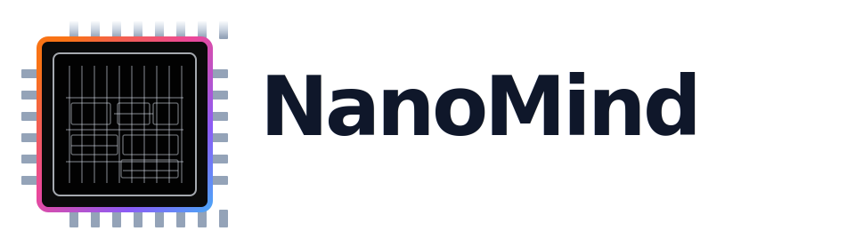
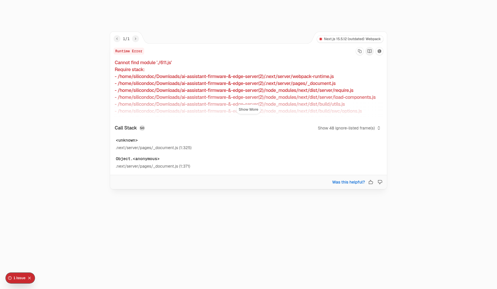

<p align="center">
  
</p>

# NanoMind / ZeroClaw

Local-first AI operating console for a Digital Worker, Rust edge routing, and ESP32 device clients.

NanoMind is the product-facing name used in the UI and branding. `ZeroClaw` still appears in the repository lineage, architecture references, and some internal naming. This README treats both names as the same system.

## Quick Routes

- [Overview](#overview)
- [What This Repo Contains](#what-this-repo-contains)
- [Current Status](#current-status)
- [Recent Updates](#recent-updates)
- [Repository](#repository)
- [UI Reference](#ui-reference)
- [Quick Start](#quick-start)
- [Architecture](#architecture)
- [Frontend Control UI](#frontend-control-ui)
- [Rust Edge Server](#rust-edge-server)
- [ESP32 Firmware](#esp32-firmware)
- [Configuration Reference](#configuration-reference)
- [Implementation Gaps](#implementation-gaps)
- [Repository Layout](#repository-layout)
- [Docs](#docs)
- [Troubleshooting](#troubleshooting)

## Overview

NanoMind is not a single chat app. It is a small AI operating stack with three major runtime layers:

1. A browser-based control interface built with Next.js.
2. A Rust edge server that handles authentication, routing, inference, and WebSocket connections.
3. ESP32-S3 firmware that acts as a thin device client connected to the edge server.

The intended operating model is:

```text
ESP32 device or browser UI
          |
          v
    Rust edge server
          |
          +--> local model via Ollama
          |
          +--> cloud fallback when local inference fails
```

This repository already contains working pieces of that model, but it is still a mixed prototype rather than a finished production system.

## What This Repo Contains

This repository currently ships:

- a Next.js frontend at the repository root
- a Rust edge server in [`ai-assistant/edge_server`](./ai-assistant/edge_server)
- ESP32 firmware in [`ai-assistant/firmware`](./ai-assistant/firmware)
- implementation notes and setup docs in [`ai-assistant/docs`](./ai-assistant/docs)

This repository does not yet ship:

- a fully aligned browser-to-edge realtime protocol
- production-ready OAuth integrations for Google or Meta services
- a unified cloud routing strategy across browser fallback and server fallback
- a real pairing API for the frontend device console
- a backend workflow scheduler or executor for automation
- a polished device fleet management backend

## Current Status

| Area | Status | Notes |
| --- | --- | --- |
| Frontend control UI | Working prototype | Simplified OpenClaw-style shell, digital worker workspace, device panels, logs, settings, and theme system are present |
| Rust edge server | Implemented | Axum server exposes `POST /query` and `GET /assistant` with token auth |
| Local inference path | Implemented | Uses Ollama `llama3` via `OLLAMA_URL/api/generate` |
| Cloud fallback in Rust | Implemented | Falls back to OpenAI-compatible path through `CLOUD_API_KEY` |
| Cloud fallback in browser | Partial | Browser fallback currently supports Gemini and direct local Ollama only; unsupported browser models report `not implemented` |
| ESP32 firmware | Implemented | Wi-Fi, WebSocket client, task setup, and response handling are present |
| Automation workspace | Local-only | UI supports create/import/edit/export of workflows in browser storage, but execution is not backed by a server scheduler |
| Integrations | Not implemented | UI shows explicit unavailable state instead of fake connected data |
| Pairing console | Not implemented | UI no longer generates fake QR/token data without a real API |
| Browser <-> edge streaming protocol | Partial | Frontend expects richer events than the current Rust WebSocket server emits |

## Recent Updates

- The UI now uses real runtime data only. Seeded devices, seeded workflows, fake integrations, and generated pairing tokens were removed.
- The assistant surface was simplified into a cleaner Digital Worker workspace.
- Automation now supports visual editing, JSON editing, drag-and-drop node building, and import/export for NanoMind, n8n, and OpenClaw-style workflow JSON.
- Integrations and pairing now explicitly report `Not implemented` or `Not connected` instead of pretending to be live.

## Repository

This project is intended to be published from the GitHub account below. The existing README content stays intact; this section only adds the repo ownership and clone details.

- GitHub username: [`ashwin20051222`](https://github.com/ashwin20051222)
- Repository: [`ashwin20051222/NanoMind`](https://github.com/ashwin20051222/NanoMind)
- Clone command: `gh repo clone ashwin20051222/NanoMind`
- Git remote URL: `https://github.com/ashwin20051222/NanoMind.git`

## UI Reference

The UI screenshot assets live in [`ui_look`](./ui_look). This README keeps the existing project documentation intact, and the GitHub README preview references that folder directly so the latest checked-in UI image renders from the repository itself.

### Overview workspace

<p align="center">
  
</p>

Current asset path:

- [`ui_look/ui-overview.png`](./ui_look/ui-overview.png)
- Repository image source: `https://github.com/ashwin20051222/NanoMind/blob/main/ui_look/ui-overview.png`

## Why This README Looks Different

This README is intentionally structured more like the `zeroclaw-labs/zeroclaw` project README: fast entry points, explicit status, practical quick-start paths, and architecture-first documentation. The implementation details below are specific to this repository, not copied claims from ZeroClaw.

Reference used for structure and tone:

- https://github.com/zeroclaw-labs/zeroclaw

## Quick Start

Pick the smallest setup that matches what you want to validate.

### Option 0: Run the UI only

Use this if you want to inspect the frontend shell and workspace behavior without standing up the backend.

1. Install Node dependencies.

   ```bash
   npm install
   ```

2. Start the frontend.

   ```bash
   npm run dev
   ```

3. Open:

   ```text
   http://127.0.0.1:3000
   ```

Notes:

- The UI can render without the Rust backend.
- Runtime state will appear offline or degraded unless the edge server is also running.
- The UI no longer seeds fake devices, workflows, integrations, or pairing tokens.
- The Gemini path requires a browser-side API key.
- Direct browser fallback to Ollama requires a local Ollama instance.
- Other browser-side model options currently report `not implemented`.

### Option 1: Run the UI with the Rust edge server

Use this if you want the frontend to talk to a real local runtime path.

1. Start Ollama locally and ensure `llama3` is available.

   ```bash
   ollama run llama3
   ```

2. Create a frontend environment file at `.env.local`.

   ```env
   NEXT_PUBLIC_WS_URL=ws://localhost:3001/assistant
   NEXT_PUBLIC_AUTH_TOKEN=super_secret_token_123
   NEXT_PUBLIC_GEMINI_API_KEY=
   ```

3. Create an edge server environment file in `ai-assistant/edge_server/.env`.

   ```env
   PORT=3001
   OLLAMA_URL=http://localhost:11434
   AUTH_TOKEN=super_secret_token_123
   CLOUD_API_KEY=
   ```

4. Start the Rust edge server.

   ```bash
   cd ai-assistant/edge_server
   cargo run --release
   ```

5. In another terminal, start the frontend.

   ```bash
   npm run dev
   ```

Important reality:

- The frontend and the edge server can now share the same default auth token.
- The frontend dev server defaults to `127.0.0.1:3000`, so the edge server needs a different port unless you also move the frontend.
- The browser still expects a richer event model than the Rust WebSocket server currently returns.
- The result is usable for local exploration, but not yet protocol-complete.

### Option 2: Bring in the ESP32 firmware

Use this if you want to test the device layer as well.

1. Set up ESP-IDF for ESP32-S3 development.
2. Configure firmware Wi-Fi and endpoint values.
3. Build and flash the firmware from [`ai-assistant/firmware`](./ai-assistant/firmware).
4. Start the Rust edge server first.
5. Monitor the device serial output for connection and response logs.

See:

- [`ai-assistant/docs/firmware_build.md`](./ai-assistant/docs/firmware_build.md)
- [`ai-assistant/docs/server_setup.md`](./ai-assistant/docs/server_setup.md)

## Architecture

### High-level architecture

```text
+-----------------------+         +---------------------------+
| Browser Control UI    |         | ESP32-S3 Device Client    |
| Next.js / React       |         | ESP-IDF / FreeRTOS        |
+-----------+-----------+         +-------------+-------------+
            |                                     |
            | WebSocket / HTTP                    | WebSocket / HTTP
            +-------------------+-----------------+
                                |
                                v
                    +---------------------------+
                    | Rust Edge Server          |
                    | Axum / Tokio              |
                    +-------------+-------------+
                                  |
                  +---------------+----------------+
                  |                                |
                  v                                v
        +--------------------+          +----------------------+
        | Ollama Local Model |          | Cloud Fallback       |
        | llama3             |          | OpenAI-compatible    |
        +--------------------+          +----------------------+
```

### Layer responsibilities

#### Browser control UI

The root app is a Next.js 15 + React 19 frontend that currently provides:

- a persistent control shell
- top-level runtime status indicators
- a left navigation rail for assistant, devices, integrations, logs, automation, and settings
- a simplified assistant workspace branded as a Digital Worker surface
- device inventory surfaces
- logs and settings workspaces
- a workflow builder that supports visual editing, JSON editing, drag-and-drop authoring, and import/export
- a right-side context panel for runtime state
- browser-side fallback logic when the edge route is unavailable
- explicit `Not connected` and `Not implemented` states instead of seeded demo data

Primary files:

- [`app/page.tsx`](./app/page.tsx)
- [`app/layout.tsx`](./app/layout.tsx)
- [`app/globals.css`](./app/globals.css)
- [`components/ChatWindow.tsx`](./components/ChatWindow.tsx)
- [`components/AutomationWorkspace.tsx`](./components/AutomationWorkspace.tsx)
- [`components/MessageBubble.tsx`](./components/MessageBubble.tsx)
- [`components/SettingsPanel.tsx`](./components/SettingsPanel.tsx)
- [`api/httpClient.ts`](./api/httpClient.ts)
- [`hooks/useNanoMind.ts`](./hooks/useNanoMind.ts)
- [`api/wsClient.ts`](./api/wsClient.ts)

#### Rust edge server

The edge server is built with Axum and Tokio. It currently provides:

- `POST /query` for device-style JSON requests
- `GET /assistant` for WebSocket connections
- constant-time token comparison
- local inference routing through Ollama
- cloud fallback when the local LLM path fails
- simple keyword-based integration interception

Primary files:

- [`ai-assistant/edge_server/src/main.rs`](./ai-assistant/edge_server/src/main.rs)
- [`ai-assistant/edge_server/src/config.rs`](./ai-assistant/edge_server/src/config.rs)
- [`ai-assistant/edge_server/src/server.rs`](./ai-assistant/edge_server/src/server.rs)
- [`ai-assistant/edge_server/src/websocket.rs`](./ai-assistant/edge_server/src/websocket.rs)
- [`ai-assistant/edge_server/src/llm_router.rs`](./ai-assistant/edge_server/src/llm_router.rs)
- [`ai-assistant/edge_server/src/cloud_fallback.rs`](./ai-assistant/edge_server/src/cloud_fallback.rs)
- [`ai-assistant/edge_server/src/session_manager.rs`](./ai-assistant/edge_server/src/session_manager.rs)

#### ESP32 firmware

The firmware is a thin device client built around ESP-IDF and FreeRTOS. It currently:

- boots multiple tasks from `app_main`
- brings up Wi-Fi
- opens an AI connection to the edge server
- handles input and response processing on-device
- logs assistant responses through the firmware runtime

Primary files:

- [`ai-assistant/firmware/main/main.c`](./ai-assistant/firmware/main/main.c)
- [`ai-assistant/firmware/main/wifi_manager.c`](./ai-assistant/firmware/main/wifi_manager.c)
- [`ai-assistant/firmware/main/ai_client.cpp`](./ai-assistant/firmware/main/ai_client.cpp)
- [`ai-assistant/firmware/main/response_handler.c`](./ai-assistant/firmware/main/response_handler.c)

## Frontend Control UI

The root frontend is the operator-facing control surface for the stack. It is not just a chat box.

Current UI characteristics:

- OpenClaw-inspired structural shell
- light and dark monochrome theme
- NanoMind branding and PWA metadata
- assistant workspace as runtime event stream
- device list and contextual system sidebar
- workspaces for devices, integrations, logs, automation, and settings

The frontend currently mixes two responsibilities:

1. It acts as the main control console.
2. It also contains direct browser-side cloud fallback logic.

That second role is useful for local exploration, but it means the frontend is currently doing more runtime work than a production control UI ideally would.

### Frontend scripts

```bash
npm run dev
npm run build
npm run start
npm run lint
```

### Frontend dependency notes

- Node 24 is the safest option for this repository right now.
- Node 25 caused engine friction during local setup.
- `npm install` is sufficient for the root frontend.

## Rust Edge Server

The Rust server is the real orchestration center in the current architecture.

### Current behavior

- accepts HTTP device queries at `POST /query`
- accepts WebSocket connections at `GET /assistant`
- authenticates clients with a shared token
- routes to integration stubs first
- tries Ollama second
- falls back to the cloud path if local inference fails

### Current configuration

Built-in defaults loaded by [`ai-assistant/edge_server/src/config.rs`](./ai-assistant/edge_server/src/config.rs):

```env
PORT=3000
OLLAMA_URL=http://localhost:11434
AUTH_TOKEN=super_secret_token_123
CLOUD_API_KEY=
```

When you run the frontend and edge server side by side on one machine, override `PORT` to `3001` and point `NEXT_PUBLIC_WS_URL` at that port.

### Rust quick commands

```bash
cd ai-assistant/edge_server
cargo run --release
```

## ESP32 Firmware

The firmware exists to make NanoMind more than a browser demo.

### Current behavior

- starts Wi-Fi setup task
- waits briefly for connectivity
- starts AI connection, input, and response tasks
- communicates with the edge server rather than talking directly to cloud providers

### Firmware assumptions

- ESP32-S3 target
- ESP-IDF toolchain installed
- reachable edge server endpoint
- shared auth/token model still in use

See:

- [`ai-assistant/docs/firmware_build.md`](./ai-assistant/docs/firmware_build.md)
- [`ai-assistant/tools/device_setup.py`](./ai-assistant/tools/device_setup.py)

## Configuration Reference

### Root frontend variables

Recommended local values when you run the frontend and edge server together:

```env
NEXT_PUBLIC_WS_URL=ws://localhost:3001/assistant
NEXT_PUBLIC_AUTH_TOKEN=super_secret_token_123
NEXT_PUBLIC_GEMINI_API_KEY=
```

If `NEXT_PUBLIC_WS_URL` is not set, the app currently falls back to `ws://localhost:3000/assistant` in code. That collides with the default Next.js dev server port, so it is better to set the variable explicitly when you run both services locally.

### Edge server variables

```env
PORT=3001
OLLAMA_URL=http://localhost:11434
AUTH_TOKEN=super_secret_token_123
CLOUD_API_KEY=
```

### About `.env.example`

The root [`.env.example`](./.env.example) is still oriented around AI Studio hosting variables and does not yet match the current local runtime setup:

- `GEMINI_API_KEY`
- `APP_URL`

That file is not a complete local-development reference for the full NanoMind stack. For local work, use the frontend and edge server environment values shown above.

## Implementation Gaps

These are the most important technical gaps in the current repository.

### 1. Frontend and edge server WebSocket protocol are not fully aligned

The frontend store expects structured events such as:

- authentication confirmation with device inventory
- streaming chunks
- response completion semantics
- richer route and model metadata
- an initial auth frame before query traffic

The current Rust WebSocket server accepts a simpler request shape:

```json
{
  "device_id": "esp32-1",
  "token": "super_secret_token_123",
  "query": "hello",
  "timestamp": 1710000000
}
```

and returns a much simpler response shape:

```json
{
  "response": "..."
}
```

The browser client also opens the socket with the `nanomind-protocol-v1` subprotocol, while the current Rust server upgrades a simpler raw WebSocket handler. That mismatch is a major reason the system still feels partially integrated instead of fully coherent.

### 2. Cloud fallback exists in two different places

There are currently two fallback strategies:

- Rust server fallback through the edge router
- browser-side fallback directly from the frontend state store for Gemini and local Ollama

That is acceptable for prototyping, but eventually the project should pick a clearer responsibility boundary.

### 3. Integrations and pairing are not implemented in the frontend

Google/Meta integrations and pairing surfaces are shown in the UI, but they intentionally report `Not implemented` until real APIs exist. The project no longer fills those panels with fake connected data or generated pairing tokens.

### 4. Automation is editor-only today

The automation workspace can create, import, edit, and export workflow definitions locally in the browser, but there is no backend scheduler/execution engine yet. Workflow data is currently a local UI artifact, not a server-controlled runtime.

### 5. Authentication is still a shared-token design

The current auth model is simple and good enough for local testing, but it is not a finished multi-user security model.

## Repository Layout

```text
.
├── app/                         # Next.js App Router entrypoints
├── components/                  # Frontend UI components
├── hooks/                       # Zustand state and utilities
├── api/                         # Browser WebSocket and HTTP helpers
├── public/                      # Manifest, branding, icons, static assets
├── ai-assistant/
│   ├── docs/                    # Architecture and setup docs
│   ├── edge_server/             # Rust runtime edge server
│   ├── firmware/                # ESP32-S3 firmware
│   └── tools/                   # Device helper scripts
├── metadata.json                # Project metadata
├── package.json                 # Frontend package manifest
├── next.config.ts               # Next.js config
└── README.md                    # Canonical project guide
```

## Docs

The new GitHub-upload-ready documentation tree starts here:

- [`docs/README.md`](./docs/README.md)

Structured sections:

- [`docs/get-started`](./docs/get-started)
- [`docs/install`](./docs/install)
- [`docs/channels`](./docs/channels)
- [`docs/agents`](./docs/agents)
- [`docs/tools`](./docs/tools)
- [`docs/models`](./docs/models)
- [`docs/platforms`](./docs/platforms)
- [`docs/gateway-ops`](./docs/gateway-ops)
- [`docs/reference`](./docs/reference)
- [`docs/help`](./docs/help)

Existing project-specific notes and setup guides also remain here:

- [`ai-assistant/docs/architecture.md`](./ai-assistant/docs/architecture.md)
- [`ai-assistant/docs/implementation_guide.md`](./ai-assistant/docs/implementation_guide.md)
- [`ai-assistant/docs/os_implementation_guide.md`](./ai-assistant/docs/os_implementation_guide.md)
- [`ai-assistant/docs/protocol.md`](./ai-assistant/docs/protocol.md)
- [`ai-assistant/docs/server_setup.md`](./ai-assistant/docs/server_setup.md)
- [`ai-assistant/docs/firmware_build.md`](./ai-assistant/docs/firmware_build.md)

## Troubleshooting

### The UI loads but shows offline or reconnecting

Likely causes:

- the Rust edge server is not running
- the frontend `NEXT_PUBLIC_WS_URL` is pointed at the wrong port
- the auth token does not match

### Frontend and edge server both try to use port `3000`

That will fail locally because Next.js already uses `127.0.0.1:3000` by default in development.

Use the split setup documented above:

- frontend on `127.0.0.1:3000`
- edge server on `127.0.0.1:3001`
- `NEXT_PUBLIC_WS_URL=ws://localhost:3001/assistant`

### Integrations or pairing show `Not implemented`

That is expected in the current repository state. Those UI surfaces no longer use fake data and now wait for real backend support.

### Automation looks empty

Likely causes:

- no workflows have been created or imported yet
- the browser local storage was cleared
- there is no backend automation scheduler in this repo yet

### The edge server starts but responses fail

Likely causes:

- Ollama is not running
- `llama3` is not available locally
- `OLLAMA_URL` is wrong
- the server is falling through to an unset cloud key

### The Gemini path fails in the browser

Likely cause:

- `NEXT_PUBLIC_GEMINI_API_KEY` is not set

### Lint or install behaves strangely

Recommended baseline:

- use Node 24
- reinstall with `npm install`
- run `npm run lint`

## Roadmap Direction

If this repository continues toward a more complete system, the highest-value next steps are:

1. Unify the browser and edge WebSocket protocol.
2. Move fallback strategy decisions into one authoritative runtime layer.
3. Replace `Not implemented` integration and pairing states with real APIs.
4. Add backend automation execution and scheduling.
5. Tighten device lifecycle management and fleet visibility.
6. Keep the frontend focused on control and observability rather than inference ownership.

## License / Ownership

No explicit license file is surfaced at the root of this repository snapshot. Add one before treating the repository as distributable open-source software.
